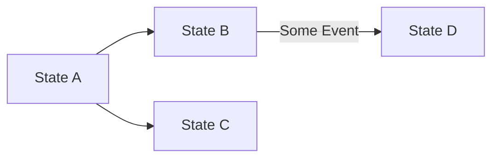
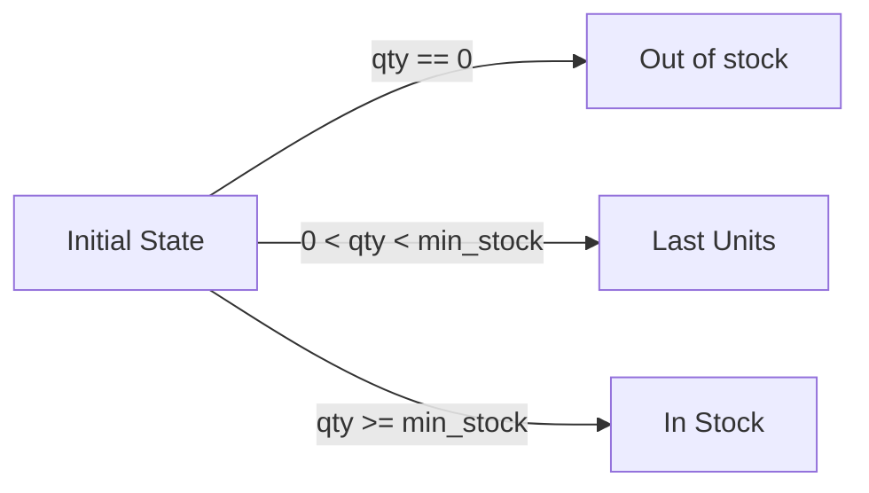
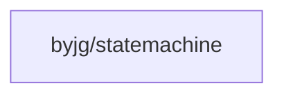

# State Machine

This component implements a Finite State Machine, which can define several states and group them in a collection
of transitions (from one state to another state). In addition, each state can have a conditional allowing move to another state.

[](https://github.com/sponsors/byjg)
[](https://github.com/byjg/php-statemachine/actions/workflows/phpunit.yml)
[](http://opensource.byjg.com)
[](https://github.com/byjg/php-statemachine/)
[](https://opensource.byjg.com/opensource/licensing.html)
[](https://github.com/byjg/php-statemachine/releases/)

Differently from other State machines, this implementation doesn't have an initial or final state.

## Documentation

- [Basic Usage](docs/basic-usage.md)
- [Auto Transition](docs/auto-transition.md)
- [Error Handling](docs/error-handling.md)
- [Advanced Features](docs/advanced-features.md)
- [Declarative Definition](docs/declarative-definition.md)
- [Using with Laravel](docs/using-with-laravel.md)
- [Using with Symfony](docs/using-with-symfony.md)

## Basic Example

Let's use the following example.

```mermaid
flowchart LR
    A[State A] --> B[State B]
    A --> C[State C]
    B -- Some Event --> D[State D]
```

We have the states A, B, C, and D, and it's their possible transitions.

First, we declare the states. A machine is defined by an enum, and its cases are exactly the states that exist:

```php
enum Letter: string
{
    case A = 'A';
    case B = 'B';
    case C = 'C';
    case D = 'D';
}
```

Then, we define the transitions. Each transition can optionally have a condition that implements `TransitionConditionInterface`. The `canTransition()` method receives the `data` array and returns `true` or `false` to allow or deny the transition.

```php
use ByJG\StateMachine\TransitionConditionInterface;

$transitionA_B = new Transition(Letter::A, Letter::B);
$transitionA_C = new Transition(Letter::A, Letter::C);

$condition = new class implements TransitionConditionInterface {
    public function canTransition(?array $data): bool {
        return !is_null($data);
    }
};
$transitionB_D = new Transition(Letter::B, Letter::D, $condition);
```

After declaring the enum and the transitions, we can create the State Machine:

```php
$stateMachine = FiniteStateMachine::createMachine(Letter::class)
    ->addTransition($transitionA_B)
    ->addTransition($transitionA_C)
    ->addTransition($transitionB_D);
```

We can validate the transition using the method `canTransition($from, $to)`. Some examples:

```php
$stateMachine->canTransition(Letter::A, Letter::B);  // returns true
$stateMachine->canTransition(Letter::A, Letter::C);  // returns true
$stateMachine->canTransition(Letter::A, Letter::D);  // returns false
$stateMachine->canTransition(Letter::B, Letter::A);  // returns false
$stateMachine->canTransition(Letter::B, Letter::D);  // returns false
$stateMachine->canTransition(Letter::B, Letter::D, ["some_info"]); // returns true
$stateMachine->canTransition(Letter::C, Letter::D); //returns false
```

We can also check if a state is initial or final:

```php
$stateMachine->isInitialState(Letter::A); // returns true
$stateMachine->isInitialState(Letter::B); // returns false
$stateMachine->isFinalState(Letter::A); // returns false
$stateMachine->isFinalState(Letter::C); // returns true
$stateMachine->isFinalState(Letter::D); // returns true
```

### Other ways to create the State Machine

Alternatively, you can create the state machine using the `createMachine` factory method with arguments as follows:

```php
$condition = new class implements TransitionConditionInterface {
    public function canTransition(?array $data): bool {
        return !is_null($data);
    }
};

$stateMachine = FiniteStateMachine::createMachine(
    Letter::class,
    [
        [Letter::A, Letter::B],
        [Letter::A, Letter::C],
        [Letter::B, Letter::D, $condition]
    ]
);
```

### Defining the State Machine as data

The condition and the action can be named by class instead of instantiated, and the states come
from an enum the file names, which lets the whole graph live outside the code — in a YAML file,
for instance:

```yaml
enum: 'App\Fsm\ArticleState'

transitions:
  - from: DRAFT
    to: REVIEW
    condition: 'App\Fsm\HasReviewer'
    action: 'App\Fsm\NotifyReviewer'

  - from: [REVIEW, PUBLISHED]
    to: ARCHIVED
```

```php
$stateMachine = FiniteStateMachine::fromDefinition(
    Serialize::fromYaml(file_get_contents('machine.yaml'))->toArray()
);
```

The definition is a plain array, so this component needs no parser of its own. Because the file
names its enum, every state in it is checked when the file is read — and the same enum can then
query the machine the file defined. See [Declarative Definition](docs/declarative-definition.md).

## Using the Auto Transition

Another feature of this component is that depending on the state you are in and the
data you pass to the state machine, it can decide what is the next state you can be.

Let's analyze the following states.


```mermaid
flowchart LR
    .[Initial State] -- qty == 0 --> A[Out of stock]
    . -- 0 < qty < min_stock --> B[Last Units]
    . -- qty >= min_stock --> C[In Stock]
```

The transition is only possible if some conditions are satisfied. So, let's create the state,
the possible transitions and its conditions.

```php
use ByJG\StateMachine\TransitionConditionInterface;

// The states, and nothing but the states:
enum Stock: string
{
    case Start = '__VOID__';
    case InStock = 'IN_STOCK';
    case LastUnits = 'LAST_UNITS';
    case OutOfStock = 'OUT_OF_STOCK';
    case Resupplied = 'RESUPPLIED';
}

// Transition conditions:
$inStockCondition = new class implements TransitionConditionInterface {
    public function canTransition(?array $data): bool {
        return $data["qty"] >= $data["min_stock"];
    }
};

$lastUnitsCondition = new class implements TransitionConditionInterface {
    public function canTransition(?array $data): bool {
        return $data["qty"] > 0 && $data["qty"] < $data["min_stock"];
    }
};

$outOfStockCondition = new class implements TransitionConditionInterface {
    public function canTransition(?array $data): bool {
        return $data["qty"] == 0;
    }
};

// Transitions:
$transitionInStock = Transition::create(Stock::Start, Stock::InStock, $inStockCondition);
$transitionLastUnits = Transition::create(Stock::Start, Stock::LastUnits, $lastUnitsCondition);
$transitionOutOfStock = Transition::create(Stock::Start, Stock::OutOfStock, $outOfStockCondition);

// Create the Machine:
$stateMachine = FiniteStateMachine::createMachine(Stock::class)
    ->addTransition($transitionInStock)
    ->addTransition($transitionLastUnits)
    ->addTransition($transitionOutOfStock);
```

The method `autoTransitionFrom` will check if is possible to do the transition with the actual data
and to what state.

```php
$stateMachine->autoTransitionFrom(Stock::Start, ["qty" => 10, "min_stock" => 20]); // returns LAST_UNITS
$stateMachine->autoTransitionFrom(Stock::Start, ["qty" => 30, "min_stock" => 20]); // returns IN_STOCK
$stateMachine->autoTransitionFrom(Stock::Start, ["qty" => 0, "min_stock" => 20]); // returns OUT_OF_STOCK
```

When auto transitioned, the state object returned has the `->getData()` method with the data used to validate it.

The transitions are evaluated **in the order they were added to the machine**, and by default the
**first** one whose condition returns `true` wins. If two conditions can be satisfied by the same
data, the result depends on that declaration order — which is a policy, and can be replaced with
`selectWith()`:

```php
use ByJG\StateMachine\Selector\HighestPriority;
use ByJG\StateMachine\Selector\RejectAmbiguous;

// Tell me when two conditions overlap, instead of silently taking the first
$stateMachine->selectWith(new RejectAmbiguous());

// Or say out loud which move wins, instead of inheriting the order lines were written in
$stateMachine->selectWith(new HighestPriority());
```

See [Auto Transition](docs/auto-transition.md) and [Error Handling](docs/error-handling.md) for details.

### Processing Transitions with Actions

A transition can carry an action implementing `TransitionActionInterface`, which runs when you
call `process()` on the state that transition produced.

```php
use ByJG\StateMachine\TransitionActionInterface;

$action = new class implements TransitionActionInterface {
    public function execute(State $from, State $to, ?array $data): void {
        echo "moved {$from} -> {$to} with " . json_encode($data);
    }
};

$transition = Transition::create(Stock::Start, Stock::InStock, $inStockCondition, $action);
```

```php
$resultState = $stateMachine->autoTransitionFrom(Stock::Start, [... data ...]);

$repository->save($entity, $resultState);   // commit the move first
$resultState->process();                    // then run the transition action
```

**Note:** `TransitionConditionInterface` *decides* whether a transition may happen and must be
free of side effects. `TransitionActionInterface` *does* the work, only for the transition
actually taken, and only when you call `process()` — the state machine never calls it for you.

Because actions live on the transition rather than the state, a single state can behave
differently depending on where it was reached from:

```php
$stateMachine = FiniteStateMachine::createMachine(Stock::class)
    ->addTransition(Transition::create(Stock::LastUnits, Stock::Resupplied, null, $viaLastUnits))
    ->addTransition(Transition::create(Stock::OutOfStock, Stock::Resupplied, null, $viaOutOfStock));

$stateMachine->autoTransitionFrom(Stock::LastUnits, $data)->process();    // runs $viaLastUnits only
$stateMachine->autoTransitionFrom(Stock::OutOfStock, $data)->process();   // runs $viaOutOfStock only
```

One `RESUPPLIED`, no `RESUPPLIED_VIA_LAST_UNITS`/`RESUPPLIED_VIA_OUT_OF_STOCK` split. When the
effect is the same on every route in, declare it once with
`Transition::createMultiple([Stock::LastUnits, Stock::OutOfStock], Stock::Resupplied, $condition, $action)`.

### Performing a Transition Explicitly

`canTransition()` only answers a question. `transition()` performs the move and returns the
state reached, stamped with the transition it came through:

```php
$next = $stateMachine->transition(Letter::B, Letter::D, ["some_info"]);  // null if not allowed
$next?->process();
```

## Other Methods

### Create multiple transitions

```php
$condition = new class implements TransitionConditionInterface {
    public function canTransition(?array $data): bool {
        return isset($data["approved"]) && $data["approved"] === true;
    }
};

$transitions = Transition::createMultiple(
    [Stock::LastUnits, Stock::OutOfStock],
    Stock::Resupplied,
    $condition
);

$machine = FiniteStateMachine::createMachine(Stock::class)
    ->addTransitions($transitions);
```

### Get possible states from a specific state

```php
$stateMachine->possibleTransitions(Letter::A);
```

### Get the State object

```php
// The State object the reference names; throws if it names no state of this machine
$state = $stateMachine->state(Stock::OutOfStock);
$state = $stateMachine->state('OUT_OF_STOCK');   // the same state
```

## Install

```bash
composer require "byjg/statemachine"
```

## Dependencies


```mermaid
flowchart TD
    byjg/statemachine
```

----
[Open source ByJG](http://opensource.byjg.com)
