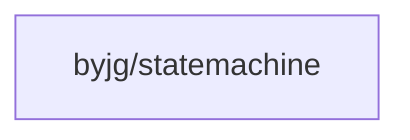

# State Machine

[](https://github.com/byjg/statemachine/actions/workflows/phpunit.yml)
[](http://opensource.byjg.com)
[](https://github.com/byjg/statemachine/)
[](https://opensource.byjg.com/opensource/licensing.html)
[](https://github.com/byjg/statemachine/releases/)

This component implements a Finite State Machine, which can define several states and group them in a collection
of transitions (from one state to another state). In addition, each state can have a conditional allowing move to another state.

Differently from other State machines, this implementation doesn't have an initial or final state.

## Basic Example

Let's use the following example.

```text
                           .-.
                          ( ? )
       .---.     .---.     '-'      .---.
       | A |---->| B |------------->| D |
       '---'     '---'              '---'
         |
         |
         v
       .---.
       | C |
       '---'
```

We have the states A, B, C, and D, and it's their possible transitions.

First, we create the states:

```php
$stA = new State("A");
$stB = new State("B");
$stC = new State("C");
$stD = new State("D");
```

Then, we define the transitions. Note that each transition object can have a closure
that receives a mixed type `data`. This closure needs to return `true` or `false`,
allowing or not the transition.

```php
$transitionA_B = new Transition($stA, $stB);
$transitionA_C = new Transition($stA, $stC);
$transitionB_D = new Transition($stB, $stD, function($data) {
    return !is_null($data);
});
```

After creating the states and the transition, we can create the State Machine:

```php
$stateMachine = FiniteStateMachine::createMachine()
    ->addTransition($transitionA_B)
    ->addTransition($transitionA_C)
    ->addTransition($transitionB_D);
```

We can validate the transition using the method `canTransition($from, $to)`. Some examples:

```php
$stateMachine->canTransition($stA, $stB);  // returns true
$stateMachine->canTransition($stA, $stC);  // returns true
$stateMachine->canTransition($stA, $stD);  // returns false
$stateMachine->canTransition($stB, $stA);  // returns false
$stateMachine->canTransition($stB, $stD);  // returns false
$stateMachine->canTransition($stB, $stD, ["some_info"]); // returns true
$stateMachine->canTransition($stC, $stD); //returns false
```

We can also check if a state is initial or final:

```php
$stateMachine->isInitial($stA); // returns true
$stateMachine->isInitial($stB); // returns false
$stateMachine->isFinal($stA); // returns false
$stateMachine->isFinal($stC); // returns true
$stateMachine->isFinal($stD); // returns true
```

### Other ways to create the State Machine

Alternatively, you can create the state machine using the `createMachine` factory method with arguments as follows:

```php
$stateMachine = FiniteStateMachine::createMachine(
    [
        ['A', 'B'],
        ['A', 'C'],
        ['B', 'D', function($data) {
            return !is_null($data);
        }]
    ]
);
```

## Using the Auto Transition

Another feature of this component is that depending on the state you are in and the
data you pass to the state machine, it can decide what is the next state you can be.

Let's analyze the following states.

```text
     .--------------.                  .----------.
     | Out of Stock |                  | In Stock |
     '--------------'                  '----------'
             ^                               ^
             |                               |
    qty == 0 |              qty >= min_stock |
             |       .-.                     |
             '------( . )--------------------'
                     '-'
                      |
                      | 0 < qty < min_stock
                      |
                      v
               .------------.
               | Last Units |
               '------------'
```

The transition is only possible if some conditions are satisfied. So, let's create the state,
the possible transitions and its conditions.

```php
// States:
$stInitial = new State("__VOID__");
$stInStock = new State("IN_STOCK");
$stLastUnits = new State("LAST_UNITS");
$stOutOfStock = new State("OUT_OF_STOCK");

// Transitions:
$transitionInStock = Transition::create($stInitial, $stInStock, function ($data) {
    return $data["qty"] >= $data["min_stock"];
});

$transitionLastUnits = Transition::create($stInitial, $stLastUnits, function ($data) {
    return $data["qty"] > 0 && $data["qty"] < $data["min_stock"];
});

$transitionOutOfStock = Transition::create($stInitial, $stOutOfStock, function($data) {
    return $data["qty"] == 0;
});

// Create the Machine:
$stateMachine = FiniteStateMachine::createMachine()
    ->addTransition($transitionInStock)
    ->addTransition($transitionLastUnits)
    ->addTransition($transitionOutOfStock);
```

The method `autoTransitionFrom` will check if is possible do the transition with the actual data
and to what state.

```php
$stateMachine->autoTransitionFrom($stInitial, ["qty" => 10, "min_stock" => 20])); // returns LAST_UNITS
$stateMachine->autoTransitionFrom($stInitial, ["qty" => 30, "min_stock" => 20])); // returns IN_STOCK
$stateMachine->autoTransitionFrom($stInitial, ["qty" => 00, "min_stock" => 20])); // returns OUT_OF_STOCK
```

When auto transitioned the state object returned have the `->getData()` with the data used to validate it.

Also, it is possible create the transition with a closure to process the state.

e.g.

```php
$stN = new State('SOMESTATE', function ($data) {
    // execute some operation with the data
})

// After run and return $stN object
// We can do this:

$resultState = $stateMachine->autoTransitionFrom('STATE', [...  data ...]));
$resultState->process(); // This will run the closure defined with the data used to validate it.
```

## Other Methods

### Create multiple transactions

```php
$transitions = Transition::createMultiple([$from1, $from2], $to, $condition);

$machine = FiniteStateMachine::createMachine()
    ->addTransitions($transitions);
```

### Get possible states from a specific state

```php
$stateMachine->possibleTransitions($stA);
```

### Get the State object

```php
// Return null if doesn't exist, otherwise return the object State
$state = $stateMachine->state('OUT_OF_STOCK');
```

## Install

```bash
composer require "byjg/statemachine"
```

## Dependencies



----
[Open source ByJG](http://opensource.byjg.com)
