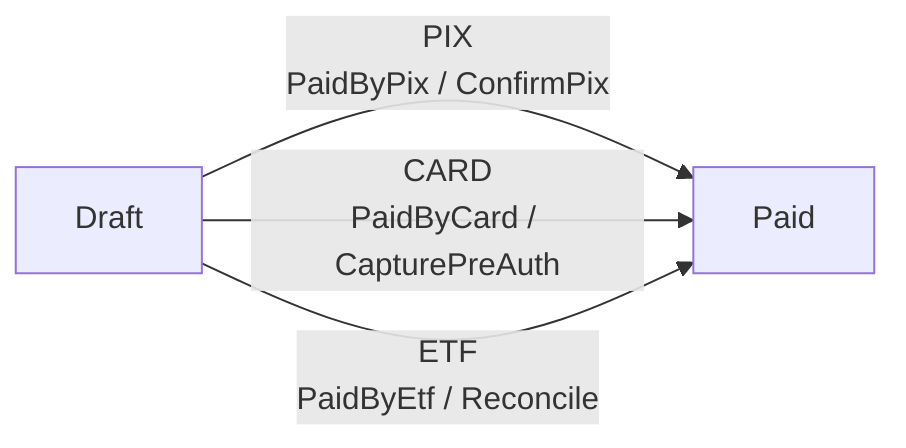
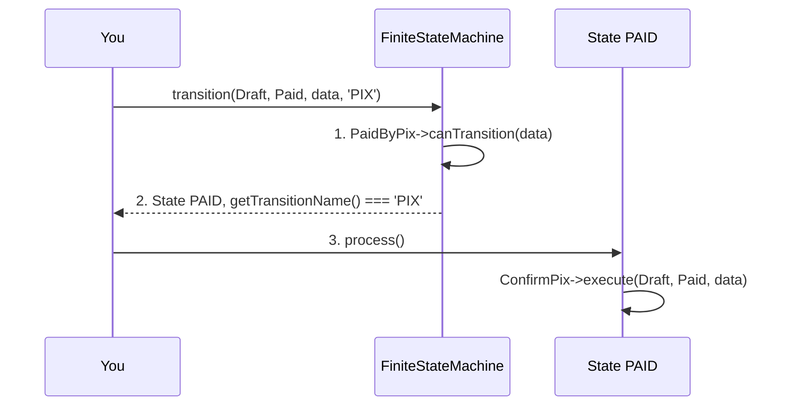

# Advanced Features

## Create Multiple Transitions

You can create multiple transitions from different states to a single state at once:

```php
use ByJG\StateMachine\TransitionConditionInterface;

$condition = new class implements TransitionConditionInterface {
    public function canTransition(?array $data): bool {
        return isset($data["approved"]) && $data["approved"] === true;
    }
};

$transitions = Transition::createMultiple(
    [OrderState::Draft, OrderState::Rejected],
    OrderState::Review,
    $condition
);

$machine = FiniteStateMachine::createMachine(OrderState::class)
    ->addTransitions($transitions);
```

This is useful when multiple states can transition to the same destination state under the same conditions.

## Naming a Transition

A pair of states usually identifies a move, so most transitions need no name. Sometimes it does
not: an order goes from `DRAFT` to `PAID` by PIX, by card or by bank transfer, and those are three
moves with three conditions and three side effects. Collapsing them into one transition would lose
exactly what distinguishes them.

There is still one `PAID` state — a state is a case of the enum and cannot be duplicated. What is
duplicated is the arrow, and the name is what tells one arrow from the other:



```php
$stateMachine = FiniteStateMachine::createMachine(OrderState::class)
    ->addTransition(Transition::named('PIX',  OrderState::Draft, OrderState::Paid, new PaidBy('PIX'),  $confirmPix))
    ->addTransition(Transition::named('CARD', OrderState::Draft, OrderState::Paid, new PaidBy('CARD'), $capturePreAuth))
    ->addTransition(Transition::named('ETF',  OrderState::Draft, OrderState::Paid, new PaidBy('ETF'),  $reconcile));
```

`autoTransitionFrom()` needs no help: it evaluates the conditions of every move leaving the state,
and the routes happening to share a destination changes nothing.

```php
$paid = $stateMachine->autoTransitionFrom(OrderState::Draft, ['method' => 'CARD']);

$paid->getState();           // 'PAID'
$paid->getTransitionName();  // 'CARD'  <- which route got you here
$paid->process();            // runs $capturePreAuth, and only that
```

`getTransitionName()` is worth persisting next to the state. `PAID` alone does not record how the
money arrived; `PAID` plus `CARD` does.

In a definition file, `name` is one more optional key:

```yaml
transitions:
  - name: PIX
    from: DRAFT
    to: PAID
    condition: 'App\Fsm\PaidByPix'
    action: 'App\Fsm\ConfirmPix'

  - name: CARD
    from: DRAFT
    to: PAID
    condition: 'App\Fsm\PaidByCard'
    action: 'App\Fsm\CapturePreAuth'
```

### Naming an explicit move

Once two states are joined more than once, the pair alone no longer identifies a move, so
`getTransition()`, `canTransition()` and `transition()` take the name as a further argument:

```php
$stateMachine->canTransition(OrderState::Draft, OrderState::Paid, $data, 'PIX');
$paid = $stateMachine->transition(OrderState::Draft, OrderState::Paid, $data, 'PIX');
```

The name is what picks the arrow, and the arrow is what decides which condition is asked and which
action ends up running:



Drop the `'PIX'` and step 1 has no answer — three arrows join those two states, so the machine
raises rather than guessing.

Asking without a name while several exist is a question with no answer, and is reported as one:

```php
$stateMachine->getTransition(OrderState::Draft, OrderState::Paid);
// TransitionException: There is more than one transition from DRAFT to PAID: PIX, CARD, ETF.
//                      Name the one you mean.
```

While a pair of states is joined only once — the common case — the name stays optional everywhere.

:::note
Names are compared uppercased, like state names, so `'pix'` and `'PIX'` are the same route. Two
moves between the same two states must differ by name; two *unnamed* moves between the same two
states are still a declaration error, because nothing tells them apart.
:::

## Get Possible Transitions

Get all possible transitions from a specific state:

```php
$possibleTransitions = $stateMachine->possibleTransitions(OrderState::Draft);
```

This returns an array of `Transition` objects representing all valid transitions from the given state.

## Get State Object

Retrieve the `State` object a reference names:

```php
$state = $stateMachine->state(OrderState::OutOfStock);
$state = $stateMachine->state('OUT_OF_STOCK');   // the same state
```

This cannot fail: every case of the enum is a state of the machine, and a reference that names
no case raises a `TransitionException`. There is no "does this state exist" question left to ask.

:::note
State names are compared uppercased, so `'out_of_stock'` and `'OUT_OF_STOCK'` name the same
state — and so does an enum whose case values are not uppercase.
:::

## Get Specific Transition

Get a specific transition between two states:

```php
$transition = $stateMachine->getTransition(OrderState::Draft, OrderState::Review);

// ...or, when several moves join that pair
$transition = $stateMachine->getTransition(OrderState::Draft, OrderState::Paid, 'PIX');
```

Returns the `Transition` object if it exists, or `null` otherwise. Throws if the pair is joined by
more than one move and no name was given — see [Naming a Transition](#naming-a-transition).
