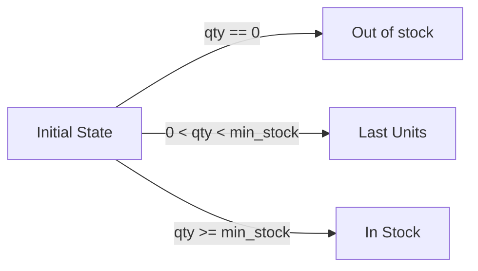

# Auto Transition

Another feature of this component is that depending on the state you are in and the
data you pass to the state machine, it can decide what is the next state you can be.

## Example: Stock Management

Let's analyze the following states:



The transition is only possible if some conditions are satisfied. So, let's create the state,
the possible transitions and its conditions.

### Declaring the States and Transitions

```php
use ByJG\StateMachine\TransitionConditionInterface;

// The states, and nothing but the states:
enum Stock: string
{
    case Start = '__VOID__';
    case InStock = 'IN_STOCK';
    case LastUnits = 'LAST_UNITS';
    case OutOfStock = 'OUT_OF_STOCK';
    case RequestedResupply = 'REQUESTED_RESUPPLY';
    case Resupplied = 'RESUPPLIED';
    case Unavailable = 'UNAVAILABLE';
}

// Transition conditions:
$inStockCondition = new class implements TransitionConditionInterface {
    public function canTransition(?array $data): bool {
        return $data["qty"] >= $data["min_stock"];
    }
};

$lastUnitsCondition = new class implements TransitionConditionInterface {
    public function canTransition(?array $data): bool {
        return $data["qty"] > 0 && $data["qty"] < $data["min_stock"];
    }
};

$outOfStockCondition = new class implements TransitionConditionInterface {
    public function canTransition(?array $data): bool {
        return $data["qty"] == 0;
    }
};

// Transitions:
$transitionInStock = Transition::create(Stock::Start, Stock::InStock, $inStockCondition);
$transitionLastUnits = Transition::create(Stock::Start, Stock::LastUnits, $lastUnitsCondition);
$transitionOutOfStock = Transition::create(Stock::Start, Stock::OutOfStock, $outOfStockCondition);

// Create the Machine:
$stateMachine = FiniteStateMachine::createMachine(Stock::class)
    ->addTransition($transitionInStock)
    ->addTransition($transitionLastUnits)
    ->addTransition($transitionOutOfStock);
```

## Using autoTransitionFrom

The method `autoTransitionFrom` will check if is possible to do the transition with the actual data
and to what state.

```php
$stateMachine->autoTransitionFrom(Stock::Start, ["qty" => 10, "min_stock" => 20]); // returns LAST_UNITS
$stateMachine->autoTransitionFrom(Stock::Start, ["qty" => 30, "min_stock" => 20]); // returns IN_STOCK
$stateMachine->autoTransitionFrom(Stock::Start, ["qty" => 0, "min_stock" => 20]); // returns OUT_OF_STOCK
```

When auto transitioned, the state object returned has the `->getData()` method with the data used to validate it.

## Evaluation Order

The transitions leaving the current state are evaluated **in the order they were added to
the machine**, and the **first** one whose condition returns `true` wins. Evaluation stops
there — the remaining conditions are not called.

This matters when two conditions can be satisfied by the same data. In the example above
the three conditions are mutually exclusive by construction (`qty == 0`, `0 < qty < min_stock`,
`qty >= min_stock`), so exactly one can match and the order is irrelevant. Conditions that
look at different keys are much easier to overlap by accident:

```php
$requested = new class implements TransitionConditionInterface {
    public function canTransition(?array $data): bool {
        return isset($data["invoice_number"]);
    }
};

$unavailable = new class implements TransitionConditionInterface {
    public function canTransition(?array $data): bool {
        return isset($data["status"]);
    }
};
```

Given `["invoice_number" => 10, "status" => "DNB"]` both conditions are `true`, and the
result is whichever transition was added first.

### Detecting Ambiguity

If your conditions are meant to be mutually exclusive, use `throwErrorIfAmbiguousTransition()`
to be told when they are not, instead of silently getting the first declaration:

```php
$stateMachine = FiniteStateMachine::createMachine(Stock::class)
    ->addTransition($transitionRequested)
    ->addTransition($transitionUnavailable)
    ->throwErrorIfAmbiguousTransition();

// Throws TransitionException:
// "Ambiguous transition from LAST_UNITS: the data provided matches REQUESTED_RESUPPLY, UNAVAILABLE"
$stateMachine->autoTransitionFrom(Stock::LastUnits, ["invoice_number" => 10, "status" => "DNB"]);
```

Data matching exactly one transition still transitions normally, and data matching none
still returns `null` (or throws, if `throwErrorIfCannotTransition()` is also enabled).

:::warning
This option evaluates **every** condition of the current state instead of stopping at the
first match. That is safe only because `canTransition()` is expected to be a pure test —
keep side effects out of your conditions and put them in `TransitionActionInterface` instead.
:::

## Processing Transitions with Actions

A transition can carry an action implementing `TransitionActionInterface`. It runs when you
call `process()` on the state the transition produced:

```php
use ByJG\StateMachine\TransitionActionInterface;

$notifyResupply = new class implements TransitionActionInterface {
    public function execute(State $from, State $to, ?array $data): void {
        echo "moved {$from} -> {$to} with " . json_encode($data);
    }
};

$transition = Transition::create(Stock::LastUnits, Stock::RequestedResupply, $requestedCondition, $notifyResupply);
```

```php
$resultState = $stateMachine->autoTransitionFrom(Stock::LastUnits, [... data ...]);

$repository->save($entity, $resultState);   // commit the move first
$resultState->process();                    // then run the transition action
```

:::tip
The data used to validate the transition is stored in the returned state and passed to
`execute()` via `process()`. `$to->getData()` returns the same array.
:::

### Actions Belong to the Transition, Not the State

This is the point of the design. Consider a state `C` reachable from both `A` and `B`, where
each route must do something different:

```php
$stateMachine = FiniteStateMachine::createMachine(Stock::class)
    ->addTransition(Transition::create(Stock::LastUnits, Stock::Resupplied, null, $viaAAction))
    ->addTransition(Transition::create(Stock::OutOfStock, Stock::Resupplied, null, $viaBAction));

$stateMachine->autoTransitionFrom(Stock::LastUnits, $data)->process();   // runs $viaAAction only
$stateMachine->autoTransitionFrom(Stock::OutOfStock, $data)->process();   // runs $viaBAction only
```

There is one `C`. No `C_VIA_A`/`C_VIA_B` split, and no `if` inside the action asking where it
came from — although `$from` and `$to` are available if you want to log the route.

When the side effect is the same on every route into a state, declare it once with
`createMultiple()`, which attaches one action to every inbound transition:

```php
Transition::createMultiple(
    [Stock::LastUnits, Stock::OutOfStock, Stock::RequestedResupply],
    Stock::Resupplied,
    $condition,
    $arrivalAction
);
```

:::info
Because the action lives on the transition, `$stateMachine->state(Stock::Resupplied)->process()`
does nothing: that state was not reached by anything, so there is no transition to run. Use
`transition()` or `autoTransitionFrom()` to obtain a state that can be processed.
:::

## Performing a Transition Explicitly

`autoTransitionFrom()` picks the target for you. When you already know both ends, use
`transition()` — it validates the condition and returns the state reached, stamped with the
transition it came through:

```php
$next = $stateMachine->transition(Stock::LastUnits, Stock::RequestedResupply, ["invoice_number" => 10]);

if ($next !== null) {
    $repository->save($entity, $next);
    $next->process();
}
```

It returns `null` when the transition is not declared or its condition denies the move, and
throws `TransitionException` instead if `throwErrorIfCannotTransition()` is enabled.
