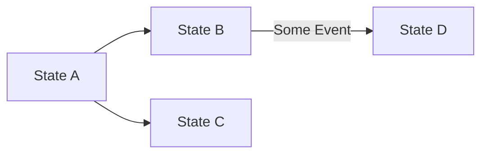

# Basic Usage

Let's use the following example:



We have the states A, B, C, and D, and their possible transitions.

## Creating States

First, we create the states:

```php
$stA = new State("A");
$stB = new State("B");
$stC = new State("C");
$stD = new State("D");
```

## Defining Transitions

Then, we define the transitions. Each transition can optionally have a **condition** that implements the `TransitionConditionInterface`. The condition's `canTransition()` method receives the `data` array and returns `true` or `false` to allow or deny the transition.

```php
use ByJG\StateMachine\TransitionConditionInterface;

// Simple transitions without conditions
$transitionA_B = new Transition($stA, $stB);
$transitionA_C = new Transition($stA, $stC);

// Transition with a condition
$condition = new class implements TransitionConditionInterface {
    public function canTransition(?array $data): bool {
        return !is_null($data);
    }
};
$transitionB_D = new Transition($stB, $stD, $condition);
```

A transition can also carry an **action** implementing `TransitionActionInterface`, which is
the side effect of taking that transition:

```php
use ByJG\StateMachine\TransitionActionInterface;

$notify = new class implements TransitionActionInterface {
    public function execute(State $from, State $to, ?array $data): void {
        // Runs when this specific transition is taken
    }
};
$transitionB_D = new Transition($stB, $stD, $condition, $notify);
```

:::info
The two interfaces do different jobs. `TransitionConditionInterface` **decides** whether the
transition may happen and must be free of side effects, since a condition may be evaluated
for a transition that is not taken. `TransitionActionInterface` **does** the work, and only
for the transition actually taken, when you call `$state->process()`.
:::

:::warning
Actions belong to the transition, not to the state. That is what lets a single state behave
differently depending on where it was reached from, without being split in two. See
[Auto Transition](auto-transition.md#processing-transitions-with-actions).
:::

## Creating the State Machine

After creating the states and the transition, we can create the State Machine:

```php
$stateMachine = FiniteStateMachine::createMachine()
    ->addTransition($transitionA_B)
    ->addTransition($transitionA_C)
    ->addTransition($transitionB_D);
```

## Validating Transitions

We can validate the transition using the method `canTransition($from, $to)`. Some examples:

```php
$stateMachine->canTransition($stA, $stB);  // returns true
$stateMachine->canTransition($stA, $stC);  // returns true
$stateMachine->canTransition($stA, $stD);  // returns false
$stateMachine->canTransition($stB, $stA);  // returns false
$stateMachine->canTransition($stB, $stD);  // returns false
$stateMachine->canTransition($stB, $stD, ["some_info"]); // returns true
$stateMachine->canTransition($stC, $stD); //returns false
```

## Checking Initial and Final States

We can also check if a state is initial or final:

```php
$stateMachine->isInitialState($stA); // returns true
$stateMachine->isInitialState($stB); // returns false
$stateMachine->isFinalState($stA); // returns false
$stateMachine->isFinalState($stC); // returns true
$stateMachine->isFinalState($stD); // returns true
```

## Alternative Ways to Create the State Machine

Alternatively, you can create the state machine using the `createMachine` factory method with arguments as follows:

```php
$condition = new class implements TransitionConditionInterface {
    public function canTransition(?array $data): bool {
        return !is_null($data);
    }
};

$stateMachine = FiniteStateMachine::createMachine(
    [
        ['A', 'B'],
        ['A', 'C'],
        ['B', 'D', $condition],
        ['C', 'D', $condition, $action]   // the fourth slot is the transition action
    ]
);
```

## Performing a Transition

`canTransition()` only answers a question. To actually move, use `transition()`, which
returns the state reached — carrying the data and the transition it came through — or
`null` when the move is not allowed:

```php
$next = $stateMachine->transition($stB, $stD, ["some_info"]);

$repository->save($entity, $next);  // commit the move first
$next->process();                   // then run the transition action
```
