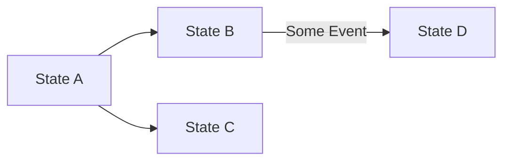

# Basic Usage

Let's use the following example:



We have the states A, B, C, and D, and their possible transitions.

## Declaring the States

A machine is defined by an enum, and its cases are exactly the states that exist:

```php
enum Letter: string
{
    case A = 'A';
    case B = 'B';
    case C = 'C';
    case D = 'D';
}
```

Everywhere a state is named you may use a case, the string it corresponds to, or a `State` the
machine produced earlier. Anything else — a misspelled name, a case of some other enum — is
rejected where it is written.

:::note
You never construct a `State` yourself. A `State` is what the machine hands back: a name plus
the data it was reached with and the transition it came through. The name on its own is what the
enum is for.
:::

## Defining Transitions

Then, we define the transitions. Each transition can optionally have a **condition** that implements the `TransitionConditionInterface`. The condition's `canTransition()` method receives the `data` array and returns `true` or `false` to allow or deny the transition.

```php
use ByJG\StateMachine\TransitionConditionInterface;

// Simple transitions without conditions
$transitionA_B = new Transition(Letter::A, Letter::B);
$transitionA_C = new Transition(Letter::A, Letter::C);

// Transition with a condition
$condition = new class implements TransitionConditionInterface {
    public function canTransition(?array $data): bool {
        return !is_null($data);
    }
};
$transitionB_D = new Transition(Letter::B, Letter::D, $condition);
```

A transition can also carry an **action** implementing `TransitionActionInterface`, which is
the side effect of taking that transition:

```php
use ByJG\StateMachine\TransitionActionInterface;

$notify = new class implements TransitionActionInterface {
    public function execute(State $from, State $to, ?array $data): void {
        // Runs when this specific transition is taken
    }
};
$transitionB_D = new Transition(Letter::B, Letter::D, $condition, $notify);
```

:::info
The two interfaces do different jobs. `TransitionConditionInterface` **decides** whether the
transition may happen and must be free of side effects, since a condition may be evaluated
for a transition that is not taken. `TransitionActionInterface` **does** the work, and only
for the transition actually taken, when you call `$state->process()`.
:::

:::warning
Actions belong to the transition, not to the state. That is what lets a single state behave
differently depending on where it was reached from, without being split in two. See
[Auto Transition](auto-transition.md#processing-transitions-with-actions).
:::

## Creating the State Machine

After declaring the enum and the transitions, we can create the State Machine. It is bound to
the enum, so every transition added to it is checked against the states that enum declares:

```php
$stateMachine = FiniteStateMachine::createMachine(Letter::class)
    ->addTransition($transitionA_B)
    ->addTransition($transitionA_C)
    ->addTransition($transitionB_D);
```

## Validating Transitions

We can validate the transition using the method `canTransition($from, $to)`. Some examples:

```php
$stateMachine->canTransition(Letter::A, Letter::B);  // returns true
$stateMachine->canTransition(Letter::A, Letter::C);  // returns true
$stateMachine->canTransition(Letter::A, Letter::D);  // returns false
$stateMachine->canTransition(Letter::B, Letter::A);  // returns false
$stateMachine->canTransition(Letter::B, Letter::D);  // returns false
$stateMachine->canTransition(Letter::B, Letter::D, ["some_info"]); // returns true
$stateMachine->canTransition(Letter::C, Letter::D); //returns false
```

## Checking Initial and Final States

We can also check if a state is initial or final:

```php
$stateMachine->isInitialState(Letter::A); // returns true
$stateMachine->isInitialState(Letter::B); // returns false
$stateMachine->isFinalState(Letter::A); // returns false
$stateMachine->isFinalState(Letter::C); // returns true
$stateMachine->isFinalState(Letter::D); // returns true
```

## Alternative Ways to Create the State Machine

Alternatively, you can create the state machine using the `createMachine` factory method with arguments as follows:

```php
$condition = new class implements TransitionConditionInterface {
    public function canTransition(?array $data): bool {
        return !is_null($data);
    }
};

$stateMachine = FiniteStateMachine::createMachine(
    Letter::class,
    [
        [Letter::A, Letter::B],
        [Letter::A, Letter::C],
        [Letter::B, Letter::D, $condition],
        [Letter::C, Letter::D, $condition, $action]   // the fourth slot is the transition action
    ]
);
```

The condition and the action may also be given as the *name* of a class implementing the
matching interface, which is what allows the whole machine to be described in a YAML file
instead of in code. See [Declarative Definition](declarative-definition).

## Performing a Transition

`canTransition()` only answers a question. To actually move, use `transition()`, which
returns the state reached — carrying the data and the transition it came through — or
`null` when the move is not allowed:

```php
$next = $stateMachine->transition(Letter::B, Letter::D, ["some_info"]);

$repository->save($entity, $next);  // commit the move first
$next->process();                   // then run the transition action
```
